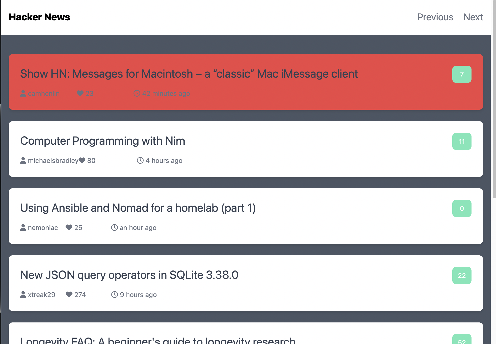

# HackerNewsSite

- 앱 설명
  - 해커뉴스가 제공하는 API를 활용한 클라이언트 개발
- 사용 Skills
  - JavaScript
- 기능 구현
  - 화면 구성 부분 구현
  - 내부 상태 관리 구현
- 성장한 부분
  - 해커뉴스 웹사이트를 통해 웹 앱이 공통적으로 가지고 있는 구조와 비동기 처리에 대한 학습

< Main UI >

< 내용 표시 UI >

< 읽음 표시 UI >

